<div align="center">



<br><br>


<br><br>


# `MOHAMMAD AMIN`

### `CYBERSECURITY STUDENT` • `LINUX` • `NETWORKING` • `CTF`

<br>

> **I don't just want to use technology.**
> **I want to understand what happens underneath it.**

<br>


<br><br>


</div>

---

# `01 // SYSTEM.IDENTITY`

<table>
<tr>
<td width="55%" valign="top">

## `WHO.AM.I`

```text
NAME        :: MOHAMMAD AMIN
ROLE        :: CYBERSECURITY STUDENT
DOMAIN      :: LINUX / NETWORKING / SECURITY
PRACTICE    :: CTF / LABS / PROJECTS
MINDSET     :: CURIOSITY > EXPERIMENT > ANALYSIS
STATUS      :: LEARNING
```

I'm Mohammad Amin — a cybersecurity student focused on understanding systems from the inside out.

I learn by doing:

**observe → investigate → experiment → break safely → analyze → rebuild**

My interests revolve around:

* Linux and operating systems
* Computer networking
* Cybersecurity fundamentals
* Web security
* Reconnaissance
* Security labs
* CTF challenges
* Python and automation
* Practical system analysis

</td>

<td width="45%" valign="top">

## `PERSONAL.INTRO`

```text
┌─────────────────────────────────────┐
│                                     │
│  I DON'T JUST WANT TO KNOW          │
│  WHICH COMMAND WORKS.               │
│                                     │
│  I WANT TO KNOW                     │
│  WHY IT WORKS.                      │
│                                     │
│  I DON'T JUST WANT TO FIND          │
│  THE BUG.                            │
│                                     │
│  I WANT TO UNDERSTAND               │
│  WHY THE BUG EXISTS.                │
│                                     │
└─────────────────────────────────────┘
```

### `MISSION`

Build real understanding through real practice.

### `CORE`

`LEARN` → `BUILD` → `BREAK` → `ANALYZE` → `IMPROVE`

</td>
</tr>
</table>

---

# `02 // RAVIN.ACADEMY`

<div align="center">


<br>

### `CYBERSECURITY STUDENT`

`LEARNING` • `PRACTICE` • `LABS` • `GROWTH`

</div>

> 🎓 I'm currently a **student at Ravin Academy**, developing my technical foundations through structured learning, practical exercises, and hands-on labs.

My goal is not simply to memorize commands or collect technologies.

The goal is to understand the technology deeply enough to **build with it, troubleshoot it, analyze it, and secure it.**

---

# `03 // CYBER.DNA`

<table>
<tr>

<td align="center" width="25%">

### 🐧

## `LINUX`

```text
Shell
Processes
Permissions
Services
Filesystems
Administration
```

</td>

<td align="center" width="25%">

### 🌐

## `NETWORKING`

```text
TCP/IP
Routing
Switching
DNS
Packets
Traffic
```

</td>

<td align="center" width="25%">

### 🛡️

## `SECURITY`

```text
Web Security
Recon
Enumeration
Analysis
Security Labs
```

</td>

<td align="center" width="25%">

### 🚩

## `CTF`

```text
Enumeration
Web
Linux
Networking
Logic
Problem Solving
```

</td>

</tr>
</table>

---

# `04 // TECH.ARSENAL`

<div align="center">

### `OPERATING SYSTEMS`


<br><br>

### `LANGUAGES & AUTOMATION`


<br><br>

### `DEVELOPMENT`


<br><br>

### `SECURITY TOOLING`


</div>

---

# `05 // CURRENTLY.IN.LAB`

```text
┌──────────────────────────────────────────────────────────────┐
│                    ACTIVE LEARNING MODULES                   │
├──────────────────────────────────────────────────────────────┤
│                                                              │
│  [01] LINUX                                                   │
│       └─ Command line / system fundamentals / administration │
│                                                              │
│  [02] NETWORKING                                              │
│       └─ Protocols / traffic / infrastructure / analysis     │
│                                                              │
│  [03] CYBERSECURITY                                           │
│       └─ Security concepts / labs / reconnaissance           │
│                                                              │
│  [04] PYTHON                                                  │
│       └─ Automation / scripting / security utilities         │
│                                                              │
│  [05] CTF                                                     │
│       └─ Enumeration / web / Linux / networking              │
│                                                              │
│  [06] PROJECTS                                                │
│       └─ Turning concepts into working systems                │
│                                                              │
└──────────────────────────────────────────────────────────────┘
```

---

# `06 // THE.SECURITY.MINDSET`

<div align="center">

|     `01`    |     `02`     |      `03`      |    `04`   |     `05`    |    `06`   |
| :---------: | :----------: | :------------: | :-------: | :---------: | :-------: |
|     👁️     |       ❓      |       🧪       |     💥    |      🔬     |    🛠️    |
| **OBSERVE** | **QUESTION** | **EXPERIMENT** | **BREAK** | **ANALYZE** | **BUILD** |

</div>

### `THINK.DEEP`

Don't memorize commands.

**Understand why they work.**

### `BUILD.REAL`

Theory becomes valuable when it survives practical testing.

### `BREAK.SAFELY`

Controlled failure is not the enemy.

It is one of the fastest ways to understand a system.

### `IMPROVE`

Every failed experiment should leave you with a better mental model.

---

# `07 // LEARNING.ENGINE`

<div align="center">


</div>

```text
                    ┌──────────────┐
                    │   DISCOVER   │
                    └──────┬───────┘
                           │
                           ▼
                    ┌──────────────┐
                    │      DIG     │
                    └──────┬───────┘
                           │
                           ▼
                    ┌──────────────┐
                    │     BREAK    │
                    └──────┬───────┘
                           │
                           ▼
                    ┌──────────────┐
                    │    ANALYZE   │
                    └──────┬───────┘
                           │
                           ▼
                    ┌──────────────┐
                    │     BUILD    │
                    └──────────────┘
```

---

# `08 // PROJECT.ZONE`

<table>

<tr>

<td width="50%" valign="top">

## 🐧 `LINUX.LAB`

System administration, shell experimentation, permissions, processes, services and Linux fundamentals.

</td>

<td width="50%" valign="top">

## 🌐 `NETWORK.LAB`

Protocols, traffic analysis, routing, switching, DNS and network behavior.

</td>

</tr>

<tr>

<td width="50%" valign="top">

## 🛡️ `SECURITY.LAB`

Controlled cybersecurity experimentation and practical security learning.

</td>

<td width="50%" valign="top">

## 🚩 `CTF.PRACTICE`

Enumeration, web challenges, Linux challenges, networking and problem solving.

</td>

</tr>

<tr>

<td width="50%" valign="top">

## 🐍 `PYTHON.TOOLS`

Automation, scripting and small utilities built while learning.

</td>

<td width="50%" valign="top">

## 🔬 `SECURITY.RESEARCH`

Understanding how systems behave, where they fail and how they can become more resilient.

</td>

</tr>

</table>

---

# `09 // GITHUB.TELEMETRY`

<div align="center">


<br><br>


</div>

---

# `10 // ACTIVITY.SIGNAL`

<div align="center">


</div>

---

# `11 // ROAD.AHEAD`

```text
LINUX
  ↓
NETWORKING
  ↓
CYBERSECURITY
  ↓
PYTHON & AUTOMATION
  ↓
CTF & PRACTICAL SECURITY
  ↓
DEEPER SYSTEM ANALYSIS
  ↓
RESEARCH
```

<div align="center">

### `THE GOAL`

**Not just knowing more tools.**

**Understanding systems at a deeper level.**

</div>

---

# `12 // SYSTEM.STATUS`

<div align="center">

```text
╔══════════════════════════════════════════════════════╗
║                  MA // CYBER CORE                    ║
╠══════════════════════════════════════════════════════╣
║                                                      ║
║  SYSTEM       :: ONLINE                              ║
║  MODE         :: LEARNING                            ║
║  ENVIRONMENT  :: LINUX                               ║
║  NETWORK      :: CONNECTED                           ║
║  SECURITY     :: ACTIVE                              ║
║  CURIOSITY    :: UNLIMITED                           ║
║  MISSION      :: KEEP LEARNING                       ║
║                                                      ║
╚══════════════════════════════════════════════════════╝
```


</div>

---

# `13 // FINAL.TRANSMISSION`

<div align="center">


### `I'M NOT INTERESTED IN LOOKING LIKE A HACKER.`

# `I'M INTERESTED IN UNDERSTANDING SYSTEMS LIKE ONE.`

<br>

```text
[ LEARN ]
     ↓
[ BUILD ]
     ↓
[ BREAK ]
     ↓
[ ANALYZE ]
     ↓
[ IMPROVE ]
```

<br>


<br><br>


<br><br>

`MA // CYBER CORE`

</div>
